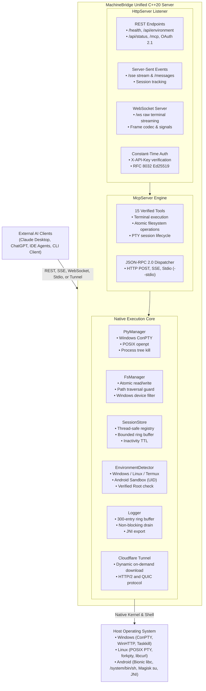
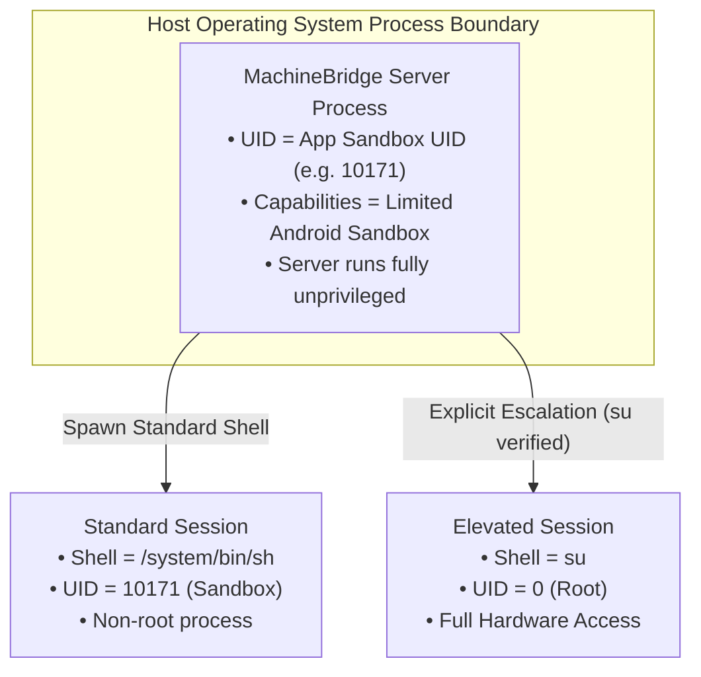
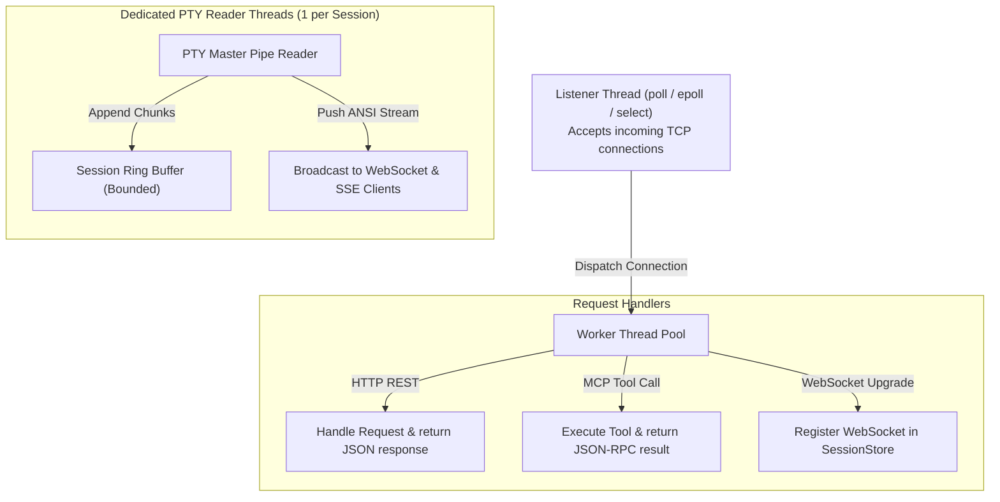

# MachineBridge (C++20) — Architecture & Design

## 1. System Overview

**MachineBridge** is a high-performance, unified, zero-runtime-dependency native C++20 engine that exposes machine execution primitives, interactive virtual terminals (PTY), and filesystem operations to AI agents (such as Claude, ChatGPT, Cursor, and custom autonomous agents).

MachineBridge eliminates multi-daemon deployment complexity, external database dependencies, and heavy language runtimes (Node.js, Python, JVM, Boost). It compiles to a lean, standalone native binary (~1 MB) and runs identically across Windows desktops, Linux servers, Android Termux, rooted Android devices, and unprivileged Android application sandboxes.

---

## 2. Core Subsystems

### 2.1 `MachineBridgeServer` (Top-Level Orchestrator)
Defined in [`include/machinebridge/server.hpp`](../include/machinebridge/server.hpp) and implemented in [`src/server.cpp`](../src/server.cpp).
* Manages the global server lifecycle (`start()`, `stop()`, `is_running()`).
* Owns and initializes the `HttpServer`, `McpServer`, `SessionStore`, `EnvironmentDetector`, and `TunnelManager`.
* Implements clean asynchronous shutdown: detaches background tunnel processes and gracefully cleans up active PTY sessions.

### 2.2 `HttpServer` (Networking & Protocols)
Defined in [`include/machinebridge/http_server.hpp`](../include/machinebridge/http_server.hpp) and implemented in [`src/http_server.cpp`](../src/http_server.cpp).
* **Multi-Protocol Support**:
  * **REST**: Fast routing for `/health`, `/api/environment`, `/api/status`, `/mcp`, and OAuth endpoints.
  * **Server-Sent Events (SSE)**: Long-lived streaming connection over `GET /sse` and message routing over `POST /messages`.
  * **WebSocket (`/ws`)**: High-frequency, low-latency bi-directional frame parsing and serializing for real-time terminal I/O.
* **Authentication**: Every request (except `/health`) validates the `X-API-Key` header or `api_key` query parameter against the server's cryptographic key using constant-time comparison to prevent side-channel timing attacks.

### 2.3 `McpServer` (Model Context Protocol Engine)
Defined in [`include/machinebridge/mcp.hpp`](../include/machinebridge/mcp.hpp) and implemented in [`src/mcp.cpp`](../src/mcp.cpp).
* Fully compliant with the **Model Context Protocol (MCP)** specification.
* Supports both **HTTP/SSE transport** and **interactive stdio mode** (`--stdio`) for local AI agents (e.g., Claude Desktop).
* Exposes **15 verified tools**:
  1. `execute_command` — Execute single shell command with timeout and ANSI capture.
  2. `execute_commands` — Execute sequential commands with stop-on-error behavior.
  3. `read_file` — Read file content with offset/length chunking and UTF-8/base64 encoding.
  4. `write_file` — Write/append file with SHA-256 verification and automatic directory creation.
  5. `delete_file` — Delete file or directory recursively.
  6. `make_directory` — Create directory hierarchies (`mkdir -p`).
  7. `move_file` — Rename or move files and directories.
  8. `copy_file` — Recursive file/directory copy with overwrite protection.
  9. `list_directory` — List directory entries with size, timestamps, and permissions.
  10. `stat_file` — Retrieve file metadata (size, isDirectory, mtime, birthtime).
  11. `batch_fs` — Atomic batch sequence of read, write, stat, and delete operations.
  12. `create_session` — Allocate persistent virtual terminal session.
  13. `send_input` — Send keystrokes, commands, or signals (`SigInt`) to a PTY.
  14. `read_output` — Retrieve accumulated output from session ring buffer.
  15. `close_session` — Terminate PTY process tree and reclaim resources.

### 2.4 `PtyManager` & Virtual Terminals
Defined in [`include/machinebridge/pty.hpp`](../include/machinebridge/pty.hpp).
* **Windows Backend (`pty_windows.cpp`)**:
  * Utilizes modern Windows Pseudo Console (`CreatePseudoConsole`, ConPTY).
  * Configures process startup attributes via `InitializeProcThreadAttributeList` and `UpdateProcThreadAttribute(PROC_THREAD_ATTRIBUTE_PSEUDOCONSOLE)`.
  * Handles standard input/output pipes with non-blocking worker threads.
  * Child process tree termination using `GenerateConsoleCtrlEvent` and recursive `taskkill /F /T`.
* **POSIX Backend (`pty_posix.cpp`)**:
  * Utilizes `posix_openpt()`, `grantpt()`, `unlockpt()`, and `ptsname()`.
  * Configures child process session via `setsid()`, `ioctl(TIOCSCTTY)`, and duplicate descriptors (`dup2`).
  * Window resizing via `ioctl(TIOCSWINSZ)`.
  * Safe process group termination using `kill(-pid, SIGTERM)` followed by `SIGKILL`.

### 2.5 `FsManager` (Filesystem Engine & Security)
Defined in [`include/machinebridge/fs.hpp`](../include/machinebridge/fs.hpp) and implemented in [`src/fs.cpp`](../src/fs.cpp).
* Implements robust path traversal protection (`..`, symlink loops, relative escaping).
* Windows reserved device name protection (blocks access to `CON`, `PRN`, `AUX`, `NUL`, `COM1`–`COM9`, `LPT1`–`LPT9`).
* Atomic batch operations: `batch_fs` validates operations before execution and supports stop-on-error semantics.

### 2.6 `SessionStore` (In-Memory Session Registry)
Defined in [`include/machinebridge/session_store.hpp`](../include/machinebridge/session_store.hpp) and implemented in [`src/session_store.cpp`](../src/session_store.cpp).
* Stores active sessions in a concurrent `std::unordered_map` guarded by read/write locks.
* Each session maintains a fixed-size ring buffer for streaming terminal output.
* Automatic background sweeper cleans up inactive sessions exceeding the configured TTL (default: 3600 seconds).

### 2.7 `EnvironmentDetector` (Multi-Environment Awareness)
Defined in [`include/machinebridge/environment.hpp`](../include/machinebridge/environment.hpp) and implemented in [`src/environment.cpp`](../src/environment.cpp).
* Discovers host environment dynamically at startup:
  * **Windows**: ConPTY available, `cmd.exe` or `powershell.exe` defaults, user identity.
  * **Linux (Native / WSL)**: POSIX PTY, `/bin/bash` default, POSIX UID/GID.
  * **Android Termux**: Detects `/data/data/com.termux`, Termux UID (`uid=10690`), `bash` shell.
  * **Android App Sandbox**: Detects `/data/user/0/com.machinebridge.app`, App Sandbox UID (`uid=10171`), `/system/bin/sh`.
  * **Verified Root**: Tests `su -c "id -u"` to verify real root elevation capability.
* Exposes complete capabilities to AI agents via `GET /api/environment`.

### 2.8 `Logger` (Lock-Free Ring Buffer)
Defined in [`include/machinebridge/logger.hpp`](../include/machinebridge/logger.hpp) and implemented in [`src/logger.cpp`](../src/logger.cpp).
* Implements a thread-safe 300-entry ring buffer.
* Exposes `get_and_clear_recent_logs()` which drains the buffer atomically.
* Consumed by Android JNI bridge every second to stream logs to the UI without blocking worker threads.

---

## 3. Host Process Identity vs. Session Execution Context

MachineBridge strictly separates the **Server Process Identity** from **Child Execution Contexts**:

| Environment | Server Process UID | Session Default Shell | Session UID | Privileged Session Available |
| :--- | :--- | :--- | :--- | :--- |
| **Windows Desktop** | User Token | `powershell.exe` / `cmd.exe` | User Token | No (standard user) |
| **Linux Server / WSL** | User UID (`1000`) | `/bin/bash` | User UID (`1000`) | If `sudo` configured |
| **Android Termux** | Termux UID (`10690`) | `/data/data/com.termux/.../bash` | `10690` | If `tsu` / `su` present |
| **Android App (Non-Root)** | App UID (`10171`) | `/system/bin/sh` | `10171` | No |
| **Android App (Rooted Phone)** | App UID (`10171`) | `su` | Root (`0`) | **Yes** (via `su`) |

This design allows an Android app running as an unprivileged process inside the app sandbox to spawn elevated root sessions on demand, without running the entire web server as root.

---

## 4. Threading & Concurrency Model

* **Non-Blocking I/O**: Pipe reads for PTY sessions execute in dedicated I/O reader threads, preventing slow terminal applications from starving HTTP endpoints.
* **Bounded Buffering**: Terminal buffers are clamped to prevent runaway memory usage if a command produces megabytes of output.
* **Detached Cleanups**: On shutdown, process termination signals are dispatched asynchronously and long-lived background threads are detached to guarantee sub-millisecond responsiveness.
