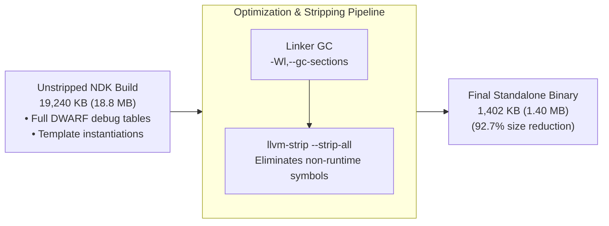
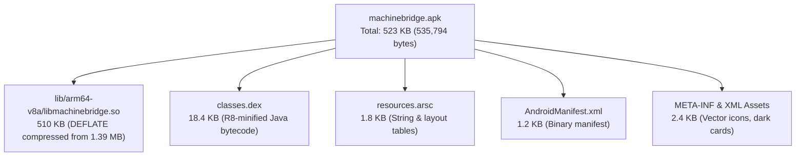

# MachineBridge (C++20) — Binary Size & Optimization Deep Dive

## 1. Overview & Size Matrix

One of the foundational design pillars of MachineBridge is delivering an ultra-lean binary footprint without sacrificing features, safety, or cross-platform portability.

| Target Platform | Architecture | Output File | Size | Compiler & Flags | Stripping / Packaging |
| :--- | :--- | :--- | :--- | :--- | :--- |
| **Windows 10/11 / Server** | `x86_64` | `machinebridge-server.exe` | **1.05 MB** | MSVC `/O2 /MT /Gy` | `/OPT:REF /OPT:ICF` |
| **Linux (Native / WSL)** | `x86_64` | `machinebridge-server` | **968 KB** | GCC 13.3 `-O3 -flto` | `strip --strip-all` |
| **Android Standalone CLI** | `arm64-v8a` | `machinebridge-server` | **1.40 MB** | Clang (NDK r26c) `-O3` | `llvm-strip --strip-all` |
| **Android Shared Library** | `arm64-v8a` | `libmachinebridge.so` | **1.39 MB** | Clang (NDK r26c) `-O3` | `llvm-strip --strip-unneeded` |
| **Android Release APK** | `arm64-v8a` | `machinebridge.apk` | **523 KB** | AGP 8.5 / Gradle / R8 | DEFLATE (`useLegacyPackaging`) |

---

## 2. The 19 MB to 1.40 MB Android Stripping Story

When building C++ code with modern C++20 features (concepts, templates, string views) using the Android NDK, debug builds and unstripped release binaries are surprisingly large:



### Why Was the Unstripped Binary 19 MB?
1. **DWARF Debug Sections**:
   * `.debug_info`: Full type and line information for every template instantiation in `nlohmann/json` and standard library algorithms (~11 MB).
   * `.debug_line`: Source mapping table (~3.8 MB).
   * `.debug_str` & `.debug_abbrev`: String tables containing compiler symbol paths (~2.4 MB).
2. **Template Symbol Bloat**: Every JSON serialization specialization generates symbol metadata.

### How We Reduced It to 1.40 MB:
1. **Linker Dead-Code Elimination**:
   * Compiler flags: `-ffunction-sections -fdata-sections`
   * Linker flags: `-Wl,--gc-sections`
   * Discards any function or global data that is never referenced.
2. **Symbol Stripping**:
   * Running `llvm-strip --strip-all build-android/machinebridge-server` strips all non-runtime symbol tables and DWARF sections.
   * For the shared library: `llvm-strip --strip-unneeded build-android/libmachinebridge.so` preserves only the exported JNI symbols (`Java_com_machinebridge_app_*`).

---

## 3. The 523 KB Android APK Architecture

Many modern Android apps with native libraries exceed 15–30 MB. MachineBridge's complete Android application is only **523 KB** (`535,794 bytes`).

### AGP 8+ Uncompressed Storage vs. DEFLATE Compression
In Android Gradle Plugin (AGP) 8+, native `.so` files are stored **uncompressed** inside the APK by default (`Method: Stored`, compression ratio 0.0%):
* **Default AGP 8 Behavior**: `libmachinebridge.so` (1.39 MB) is stored raw. APK size becomes ~1.5 MB.
* **Our Optimization**: We enable legacy packaging in `app/build.gradle`:
  ```groovy
  android {
      packaging {
          jniLibs {
              useLegacyPackaging = true
          }
      }
  }
  ```
* **Result**: Gradle compresses `libmachinebridge.so` using native DEFLATE compression. Because C++ machine code and text strings compress efficiently (deflate ratio ~63%), the 1.39 MB library shrinks down to **510 KB** inside the zip!

### Complete APK Composition Breakdown



**Zero Heavy UI Libraries**: No Jetpack Compose, no Material Components bloat, no Kotlin runtime (`kotlin-stdlib` adds ~1.5 MB). Pure Android Java framework with native dark-mode vector cards.

---

## 4. Zero-Dependency & Cloudflare Tunnel On-Demand Design

### Why Cloudflare Tunnel is NOT Bundled
The official Go-based `cloudflared` binary is **~70 MB**.
* If bundled into the binary or APK, the download size would increase from 523 KB to **over 70 MB**.
* Instead, MachineBridge integrates the `cloudflare-tunnel` C++ library:
  1. The client binary is downloaded dynamically only when `--tunnel` is requested (or toggled in the APK).
  2. It is verified using pinned SHA-256 hashes (`releases.hpp`).
  3. It is cached locally in `%LOCALAPPDATA%` (Windows), `~/.cache` (Linux), or the app cache sandbox (`/data/user/0/.../cache`) on Android.

### Vendored Header-Only Dependencies
* MachineBridge vendors exactly one third-party library: `nlohmann/json` (single header `include/nlohmann/json.hpp`).
* Networking uses platform-native primitives:
  * Windows: Native WinSock2 and WinHTTP.
  * Linux: Native POSIX sockets and optional dynamic libcurl.
  * Android: Native Bionic libc sockets.
* Cryptography: Self-contained RFC 8032 Ed25519 and SHA-256 implementation, eliminating the need to bundle OpenSSL (which would add ~3.5 MB of shared libraries).

---

## 5. Compiler Optimization Settings Reference

### Windows MSVC (`CMakeLists.txt`)
```cmake
if(MSVC)
    # Static C Runtime to eliminate VCRUNTIME140.dll requirement
    set(CMAKE_MSVC_RUNTIME_LIBRARY "MultiThreaded$<$<CONFIG:Debug>:Debug>")
    
    # Speed & size optimizations
    add_compile_options(/O2 /Gy /W4 /permissive-)
    add_link_options(/OPT:REF /OPT:ICF)
endif()
```

### GCC / Clang / NDK (`CMakeLists.txt`)
```cmake
if(CMAKE_CXX_COMPILER_ID MATCHES "GNU|Clang")
    add_compile_options(-O3 -ffunction-sections -fdata-sections -Wall -Wextra)
    add_link_options(-Wl,--gc-sections)
endif()
```
