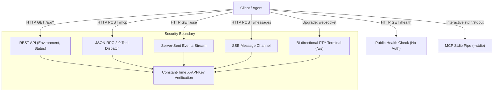

# MachineBridge (C++20) — Wire Protocol Specification

## 1. Overview

MachineBridge exposes a unified interface spanning **HTTP/1.1 REST**, **Server-Sent Events (SSE)**, **WebSocket (WS)**, and the **Model Context Protocol (MCP)** via JSON-RPC 2.0.

All endpoints (with the exception of `/health` and OAuth authorization UI) require authentication via either:
* Header: `X-API-Key: <your-api-key>`
* Query Parameter: `?api_key=<your-api-key>`



---

## 2. HTTP REST Endpoints

### 2.1 `GET /health`
Public health check endpoint. Does not require authentication.
* **Response `200 OK`**:
  ```json
  {
    "ok": true,
    "status": "healthy",
    "version": "1.0.0",
    "uptime_seconds": 1245,
    "tunnel_url": "https://random-words.trycloudflare.com"
  }
  ```

### 2.2 `GET /api/environment`
Returns detailed environment and execution context information detected by `EnvironmentDetector`.
* **Response `200 OK`**:
  ```json
  {
    "type": "linux",
    "is_root": false,
    "process_uid": 1000,
    "effective_uid": 1000,
    "default_shell": "/bin/bash",
    "home_dir": "/home/user",
    "tmp_dir": "/tmp",
    "workspace_dir": "/home/user/workspace",
    "privileged_shell_available": true,
    "host_capabilities": {
      "pty": true,
      "fs": true,
      "tunnel": true,
      "signals": true
    }
  }
  ```

### 2.3 `GET /api/status`
Returns real-time server runtime status, memory metrics, and active session count.
* **Response `200 OK`**:
  ```json
  {
    "active_sessions": 2,
    "max_sessions": 10,
    "session_ttl_seconds": 3600,
    "recent_log_count": 48
  }
  ```

---

## 3. Model Context Protocol (MCP) Endpoints

### 3.1 `POST /mcp` (HTTP JSON-RPC 2.0 Transport)
Execute MCP tools via standard JSON-RPC 2.0 requests.

* **Request Headers**:
  ```http
  Content-Type: application/json
  X-API-Key: your-secret-api-key
  ```

* **Request Body (Tool Call)**:
  ```json
  {
    "jsonrpc": "2.0",
    "id": 1,
    "method": "tools/call",
    "params": {
      "name": "execute_command",
      "arguments": {
        "command": "uname -a"
      }
    }
  }
  ```

* **Response Body `200 OK`**:
  ```json
  {
    "jsonrpc": "2.0",
    "id": 1,
    "result": {
      "content": [
        {
          "type": "text",
          "text": "Linux machine 6.6.0 #1 SMP PREEMPT x86_64 GNU/Linux\n"
        }
      ],
      "isError": false
    }
  }
  ```

### 3.2 Server-Sent Events Transport (`GET /sse` & `POST /messages`)
* **`GET /sse`**: Client connects and receives an initial `endpoint` event containing a unique session URI:
  ```text
  event: endpoint
  data: /messages?session_id=c4b7...
  ```
* **`POST /messages?session_id=...`**: Client sends JSON-RPC 2.0 messages; server streams tool execution updates back over the SSE channel.

### 3.3 Interactive Stdio Transport (`--stdio`)
When launched with `--stdio`, MachineBridge reads JSON-RPC 2.0 requests directly from standard input (`stdin`) and writes responses to standard output (`stdout`), formatted with `Content-Length` headers or newline delimiters. This enables plug-and-play integration with Claude Desktop.

---

## 4. WebSocket Streaming Protocol (`WS /ws`)

MachineBridge provides bi-directional raw pseudo-terminal streaming over WebSockets for interactive shells, ncurses applications (vim, htop, nano), and high-frequency terminal output.

* **Connection URL**: `ws://<host>:<port>/ws?session_id=<id>&api_key=<key>`
* **Frame Formats**:
  * **Input to Server (JSON or raw binary)**:
    ```json
    { "type": "input", "data": "ls -la\n" }
    { "type": "resize", "cols": 120, "rows": 40 }
    { "type": "signal", "signal": "SIGINT" }
    ```
  * **Output from Server**:
    Raw UTF-8 terminal text chunks containing ANSI escape sequences pushed as soon as received from the PTY master pipe.
