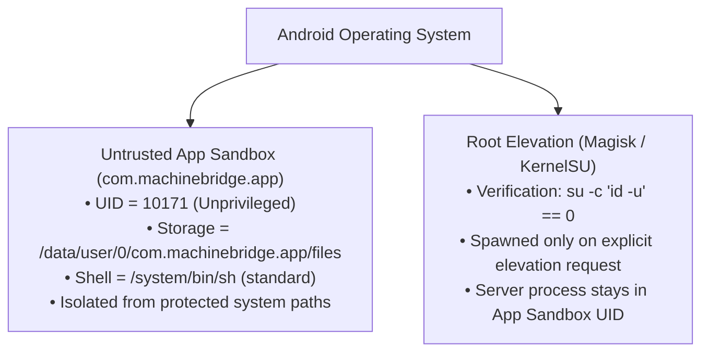

# MachineBridge (C++20) — Security Architecture & Threat Model

## 1. Security Principles

MachineBridge gives AI agents access to machine execution and filesystem operations. Consequently, security, strict isolation boundaries, and timing-safe authentication are core architectural requirements.

The security architecture is founded on five core pillars:
1. **Zero Unauthenticated Access**: Every operation (except public health checks) requires verification.
2. **Timing-Safe Constant-Time Verification**: Resists side-channel attacks on secret keys.
3. **Strict Filesystem Boundary Protection**: Traversal attacks, symlink loops, and reserved device exploits are thwarted before reaching OS system calls.
4. **Clean Process Tree Termination**: No orphaned child processes, memory leaks, or background miners can linger after a session terminates.
5. **Privilege Separation**: Unprivileged server processes never run as root unless explicitly configured; privileged operations require verified authentication and explicit user escalation.

---

## 2. Authentication & Cryptography

### 2.1 Constant-Time API Key Verification
API keys are verified using `crypto::timing_safe_equal` which executes in constant time regardless of where a mismatch occurs:

```cpp
bool timing_safe_equal(std::string_view a, std::string_view b) {
    if (a.size() != b.size()) {
        return false;
    }
    unsigned char result = 0;
    for (size_t i = 0; i < a.size(); ++i) {
        result |= static_cast<unsigned char>(a[i] ^ b[i]);
    }
    return result == 0;
}
```
This guarantees that external attackers cannot deduce the valid API key byte-by-byte via statistical timing analysis.

### 2.2 RFC 8032 Ed25519 Signatures
MachineBridge implements standalone RFC 8032 Ed25519 digital signature generation and verification for webhook callbacks and signed message assertions.

### 2.3 OAuth 2.1 PKCE Flow
For interactive browser authentication and third-party AI agents, MachineBridge implements the OAuth 2.1 authorization code grant with Proof Key for Code Exchange (PKCE, RFC 7636). Code verifiers are hashed using SHA-256 (`code_challenge_method = S256`) to protect authorization codes against interception.

---

## 3. Filesystem Sandboxing & Traversal Defenses

The `FsManager` subsystem enforces defensive checks before interacting with the host filesystem:

### 3.1 Path Traversal Guards
* Absolute paths outside the configured `--workspace` boundary are rejected when workspace confinement is active.
* All relative paths are normalized and resolved against canonical roots; attempts to escape using `../` or encoded traversal sequences (`%2e%2e%2f`) return access-denied errors.
* Symbolic links that resolve outside allowed boundaries are rejected.

### 3.2 Windows Reserved Device Name Defenses
On Windows platforms, access to legacy DOS device names (which can hang processes or cause blue screens) is explicitly intercepted and blocked:
* Reserved names: `CON`, `PRN`, `AUX`, `NUL`, `COM1`–`COM9`, `LPT1`–`LPT9`.
* Both exact names and names with arbitrary extensions (e.g. `aux.txt`, `con.json`) are blocked.

---

## 4. Android Sandbox vs. Elevated Execution

On Android devices, MachineBridge implements a dual-mode execution model:



This ensures that running the server on an Android phone never exposes the root shell unless explicitly requested and permitted by the device's superuser manager.
